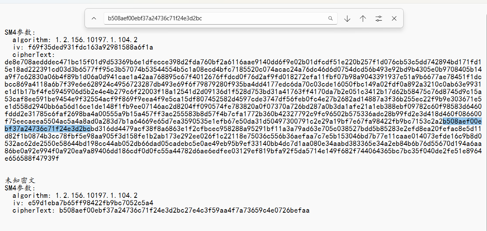
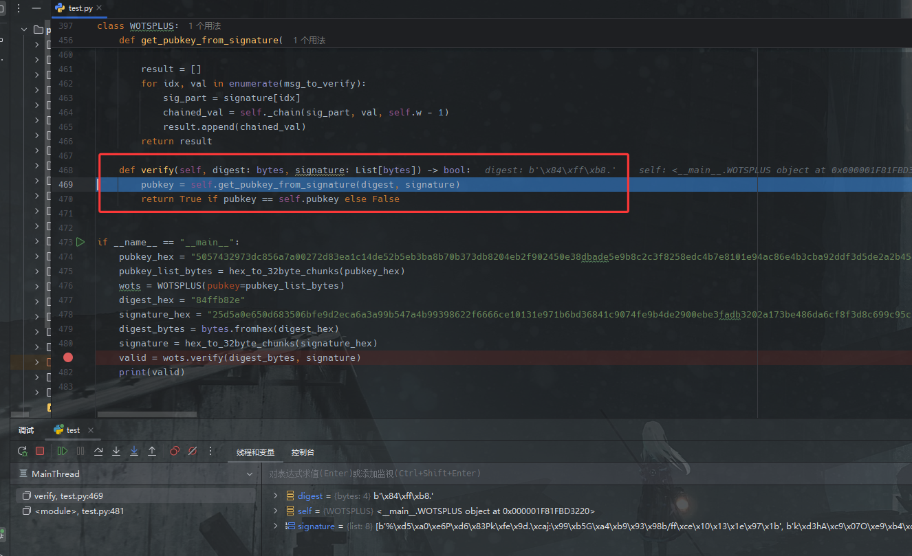
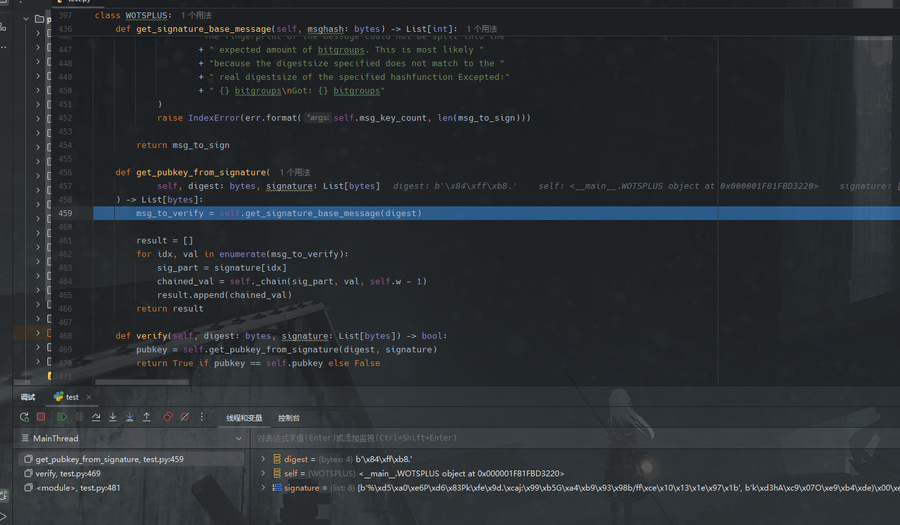
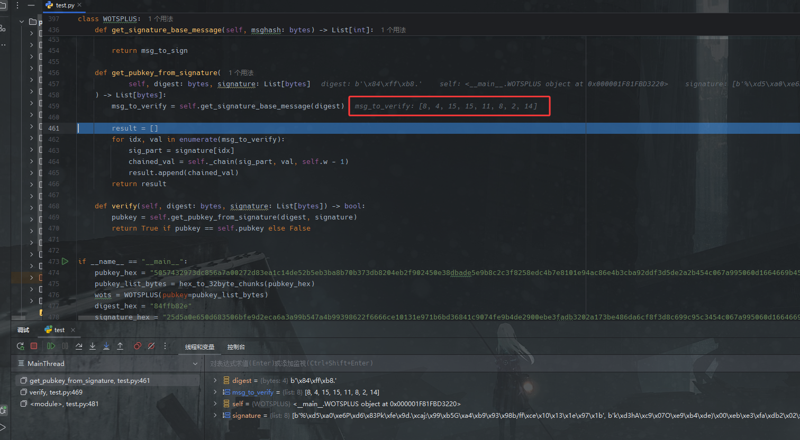
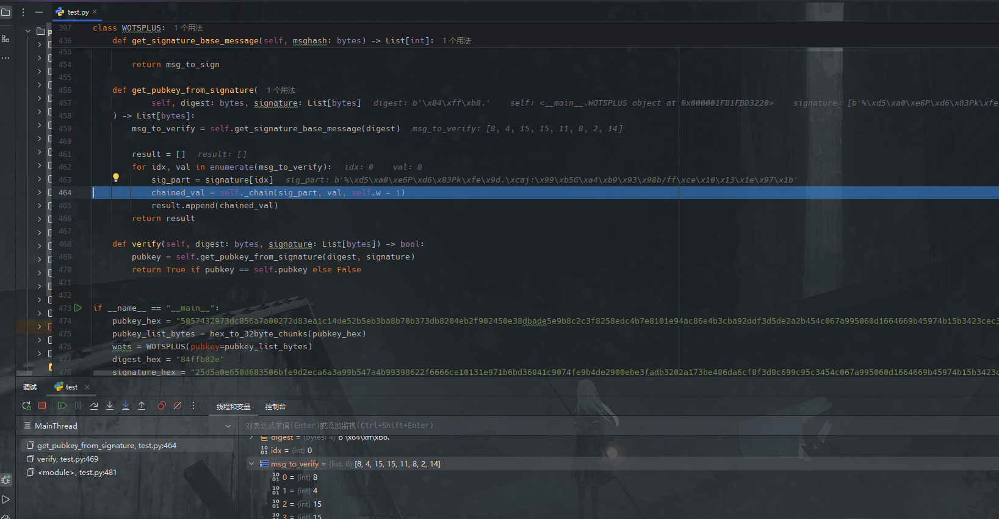
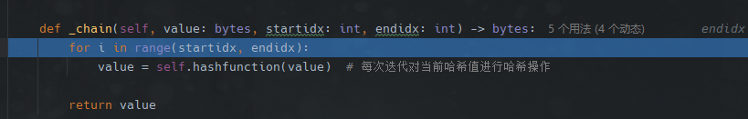
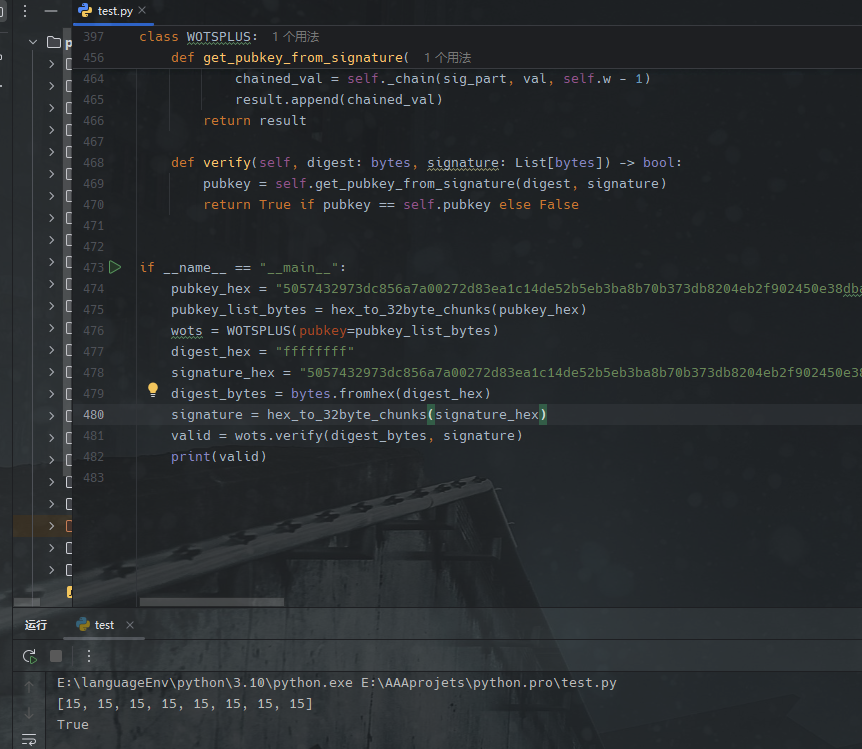
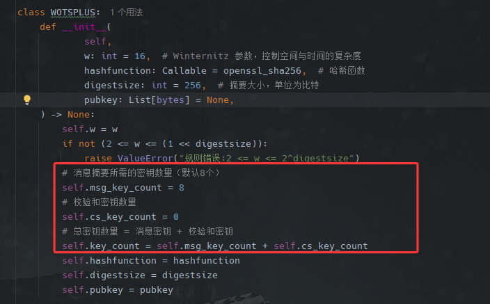

最近由于工作关系，需要对熵密杯的题目进行梳理，于是记录于此，同时也复习一下相关内容。


# 题1：
sm4_encrypt.py
```python
import binascii
from pyasn1.codec.der.decoder import decode
from pyasn1.type import univ, namedtype
from cryptography.hazmat.primitives.ciphers import Cipher, algorithms, modes
from cryptography.hazmat.backends import default_backend
from gmssl import sm3, func, sm2
from pyasn1.codec.der.encoder import encode


class SM2Cipher(univ.Sequence):
    componentType = namedtype.NamedTypes(
        namedtype.NamedType('xCoordinate', univ.Integer()), # -- x 分量
        namedtype.NamedType('yCoordinate', univ.Integer()),             # -- y 分量
        namedtype.NamedType('hash', univ.OctetString()),                # --哈希值
        namedtype.NamedType('cipherText', univ.OctetString())           # -- SM4密钥密文
    )

class EncryptedData(univ.Sequence):
    componentType = namedtype.NamedTypes(
        namedtype.NamedType('algorithm', univ.ObjectIdentifier('1.2.156.10197.1.104.2')), # -- SM4-CBC OID
        namedtype.NamedType('iv', univ.OctetString()),                                                # -- SM4-CBC加密使用的初始化向量（IV）
        namedtype.NamedType('cipherText', univ.OctetString())                                         # -- SM4加密的密文
    )

class EnvelopedData(univ.Sequence):
    componentType = namedtype.NamedTypes(
        namedtype.NamedType('encryptedKey', SM2Cipher()),                           # -- 使用SM2公钥加密SM4密钥的密文
        namedtype.NamedType('encryptedData', EncryptedData()),                                  #  -- 使用SM4密钥对明文加密的密文
        namedtype.NamedType('digestAlgorithm', univ.ObjectIdentifier('1.2.156.10197.1.401.1')), # -- SM3算法OID
        namedtype.NamedType('digest', univ.OctetString())                                       # -- 对明文计算的摘要值
    )

def sm4_cbc_encrypt(plaintext: bytes, key: bytes, iv: bytes):
    backend = default_backend()
    cipher = Cipher(algorithms.SM4(key), modes.CBC(iv), backend=backend) #填充模式 nopadding
    encryptor = cipher.encryptor()
    ciphertext = encryptor.update(plaintext) + encryptor.finalize()
    return ciphertext

def sm2_encrypt(plaintext: bytes,public_key:bytes) -> bytes:
    sm2_crypt = sm2.CryptSM2(private_key="",public_key=public_key.hex())
    ciphertext = sm2_crypt.encrypt(plaintext)
    return ciphertext

def sm3_hash(text:bytes):
    hash_value = sm3.sm3_hash(func.bytes_to_list(text))
    return hash_value

def read_key_from_file(file_path):
    try:
        with open(file_path, 'r') as file:
            key = file.read().strip()
            return key
    except FileNotFoundError:
        print(f"错误: 文件 {file_path} 未找到。")
    except Exception as e:
        print(f"错误: 发生了未知错误 {e}。")
    return None

# 对由abcd组成的字符串加密的方法
def sm4_encrypt(plaintext:str,sm2_public_key: str,sm4_iv:str):
    sm4_key = bytes.fromhex(read_key_from_file("key.txt")) #从文件读取固定的key
    # sm4
    envelope = EnvelopedData()
    plaintext_bytes = plaintext.encode('utf-8')
    ciphertext = sm4_cbc_encrypt(plaintext_bytes,sm4_key,bytes.fromhex(sm4_iv))

    # sm2
    encrypted_key = sm2_encrypt(sm4_key,bytes.fromhex(sm2_public_key))

    # sm3
    digest = sm3_hash(plaintext_bytes)

    envelope['encryptedData'] = EncryptedData()
    envelope['encryptedData']['iv'] = univ.OctetString(bytes.fromhex(sm4_iv))
    envelope['encryptedData']['cipherText'] = univ.OctetString(ciphertext)

    envelope['encryptedKey'] = SM2Cipher()
    envelope['encryptedKey']['xCoordinate'] = univ.Integer(int.from_bytes(encrypted_key[:32], 'big'))
    envelope['encryptedKey']['yCoordinate'] = univ.Integer(int.from_bytes(encrypted_key[32:64], 'big'))
    envelope['encryptedKey']['hash'] = univ.OctetString(encrypted_key[64:96])
    envelope['encryptedKey']['cipherText'] = univ.OctetString(encrypted_key[96:])

    envelope['digest'] = univ.OctetString(bytes.fromhex(digest))
    return encode(envelope).hex()

# 从asn1格式的16进制字符串提取参数
def asn1_parse(asn1_hex_str:str,asn1_spec):
    # 将16进制字符串转换为字节
    der_bytes = binascii.unhexlify(asn1_hex_str)
    # 解码为ASN.1对象
    enveloped_data, _ = decode(der_bytes, asn1Spec=asn1_spec)
    # sm2
    sm2_x = hex(int(enveloped_data['encryptedKey']['xCoordinate']))[2:]
    sm2_y = hex(int(enveloped_data['encryptedKey']['yCoordinate']))[2:]
    sm2_hash = enveloped_data['encryptedKey']['hash'].asOctets().hex()
    sm2_ciphertext = enveloped_data['encryptedKey']['cipherText'].asOctets().hex()

    # sm4
    sm4_algorithm = str(enveloped_data['encryptedData']['algorithm'])
    sm4_iv = enveloped_data['encryptedData']['iv'].asOctets().hex()
    sm4_cipherText = enveloped_data['encryptedData']['cipherText'].asOctets().hex()

    # sm3
    digestAlgorithm = str(enveloped_data['digestAlgorithm'])
    digest = enveloped_data['digest'].asOctets().hex()

    # 输出提取的值
    print("asn1格式的16进制字符串:")
    print(f"  asn1: {asn1_hex_str}")
    print("SM2参数:")
    print(f"  xCoordinate: {sm2_x}")
    print(f"  yCoordinate: {sm2_y}")
    print(f"  hash: {sm2_hash}")
    print(f"  cipherText: {sm2_ciphertext}")

    print("SM4参数:")
    print(f"  algorithm: {sm4_algorithm}")
    print(f"  iv: {sm4_iv}")
    print(f"  cipherText: {sm4_cipherText}")

    print("SM3参数:")
    print(f"  digestAlgorithm: {digestAlgorithm}")
    print(f"  digest: {digest}")


if __name__ == "__main__":
    plaintext = "6163616263626161626461646464636361626263626464626361616164636462636462646461646461626462646361636264616364646462646462626261636261646163626463636262616462646462616362616363646463646361616263646261636164636263646163646161636164646364646261626463636462636162636162646261626163636161616463616261646264616162646162626162626462616363616161636362616461626463616462646261626264626464626262636363636162616261626163616164616462626163636164646161646361626363646462626261636261636164646262646362616263636363626461636164646261636361646463616161626164626461636163636461646164616161616163616164636164646261646163626163636164616162636263616461636261646264626263626264636164646263616164626463626461646364616362626261616262616264616361626264636264616461646163626364626462636161636262636163616261616262626362636463616263616364616363626163636363636262646363616464626461616363646361626162636261636364646362626462616364626462626161616264636162626263626462626264646162626462616261616264626161616363636364616263626461636162616462616363616461646363636261636363616162646164626361616464646463646263646363636164626164646463646361636364616261626261646461646463626161616361626161626362626262636164626463636163626163616163636262646463646162616363616364636164646364626464626164626162636161616263646164636461626161636262646463636462646161636462626264626463646364636362626264616362646462636263616361626262616464636263616464616363646163616262616162626261626261616461636361636164636162626461646264636162646363636263616363646161636464626161616462636464646164616361646264616361626263646264616162636164636462616164646163616461646362626464"
    sm2_key = "044f66804d1d30f4499377b96dc8e18faab8300ebddf3eb0fa2065214c260d64c08c6dfe7d9923d6d5baa3a0512a2ede03357c723230ebf77906f82dc1b0fccc1e"
    iv = "43d4192f9f74e90543d4192f9f74e905"
    asn1_hex_str = sm4_encrypt(bytes.fromhex(plaintext).decode('utf-8'),sm2_key,iv)
    asn1_parse(asn1_hex_str,EnvelopedData())
```

data.txt
```txt
已知明文字符串由小写字母abcd(对应16进制数分别为61,62,63,64)组成

历史明文(16进制):
6462646361626161636364626364646263646161626463616261646262636462646162626263626164636363636463616163626462616363626163616362646261616463646161616264636264626364646363616163626464616263636461636262646162636363646161626263646161636262636462646262626361616161626361636364646463616463626361636164626162646162646463636162616161646161636264646161646364626164636264626463636463636361646464616363616463626462636162636163636361636161636161646163646164636462636162646262616363646361616264616263646163636362646362636361626162646163636164646361616364616363646362636364636262616262636261616264636162636462646164636461646264646262636161636163636162616461636261636463636263636264616261626164636461616364636461626363636262636461626362616463636362616263626263636463646161636361616162646362626261636363616464636362616264636362626261626264626262636164626462636464616164646263646462616261616161646464616464636361646163646363646361636463636162626262616363626463636461626361626463616263616261626464636261616461616162626264616162646463646363626464626162626162636263616262636461646162646263646164636362646362646264636364616361616262646262636462626261646261646461646264616362646463646362616363616164646361636264636262626263636264646363616462616161626163636464646161636464646462616461636261616263616262626262646161636163646363626362646462626261646264636362626264646263646263616362626164646164626164646162636161636162626462616461646262626362636264646461646261636161636463626464636361626164646264616364636364616163616161646263626162626164646164616162636462636362626461646163636361646464646462626162646163616263636163626362616164
对历史明文加密后的密文(16进制、ASN.1结构):
308203ec3079022100ff5673947ad9c366d38f0cd132ad7ba0b6a63ea59f76f0e25b67df69798a89d5022012c812d006516f4e88b555598ab2e550dcd2d2a9b9b556983b611b9f128f9bd7042032a5dec2edaabfba2eb099e58d7750968f575ec528cb2ad5e0d030c6e0abe62004101707b9e19548c1dd622a08bded3727f43082034006082a811ccf550168020410f69f35ded931fdc163a92981588a6f1a04820320de8e708aedddec471bc15f01d9d53369b6e1dfecce398d2fda760bf2a6116aae9140dd6f9e02b01dfcdf51e220b257f1d076cb53c5dd742894bd171fd15e18ad222391cd03d3b6577ff95c3b57074b53544554b5c1a08ecd4bfc7185520c074acac24a76dc46d6d0754dcd56b493e92bd9b4305e0b9708405b14a9f7c62830a06b4f89b1d06a0d941cae1a42aa768895c67f4012676ffdcd0f76d2af9fd018272efa11fbf07b98a9043391937e51a9b6677ae78451f1dcbcc869a4118a6b7f39e6e628924c4956723287db493e69f6f79879280f935ba4dd4177edc6da70c03cde16050fbc149a02fdf0a892a3210c0ab63e9931e1d1b17bf4fe5945906d5b2e4e4b279c6f22003f18a12541d2d09136d1f528d753bd31a41763ff4170da7b2e051c3412b17d62b58475c76d8745d9c15a53caf8ee591be9454e9f32554acf9f869f9eea4f9e5ca15df807452582d4597cde3747df56feb0fc4e27b2682ad14887a3f36b255ec22f9b9e303671e5e1d558d2940bb6a56d16ce1de148f1fb9ee07146ac2d8204ff090574fe783820a0f07370a726bd287a0b3da1afe21a1eb388ebf09782c60f98583d6460fddd2e31785c6faf2698ba4a00555a9b15a457ff3ac255583b8d57f4b7cfa1772b360b42327792c9fc96502b575336adc28b99fd2e3d418d460f086600f75eecaeea5504ac5a4a8ad0a283d7b1a64669e65d7ea3590535e1efb67e50da31d50497300791c2e29a19bf7e67fa98422fb9bc7153c2a2b508aef00ebf37a24736c71f24e3d2bcbd316dd4479acf38f8a6863e1f2cfbcec958288a95291bf11a3a79ad63e705c038527bdd5b85283e2efd8ea20fefac8e5d11d82f1b0874b3cc78fbf5e98aa905f3d158fe1b2ab173e292ee026f1c22118e75036c556b36aefaa7c7e5b153046bd7b77e11caae014073efde16c9b8d0532ac62de2550e58644bd198cc44ab052db66dad05cadebc5e0ae49eb95b9ef33140bb4dc7d1aa080e34aabd383365e34a2eb84b6b76d55670d194a6aa86be0a92e994f0a920ea9a89406dd186cdf0d0fc55a44782d6ae6edfee03129ef819bfa92f5da5714e149f682f744064365bc7bc35f040de2fe51e8964e656588f47939f06092a811ccf5501831101042042ebbdaa6ea569a1073a487750eb91c25ee940a60c243d0408a9d479737bbd99

目标密文(16进制、ASN.1结构):
3081e83079022100ff5673947ad9c366d38f0cd132ad7ba0b6a63ea59f76f0e25b67df69798a89d5022012c812d006516f4e88b555598ab2e550dcd2d2a9b9b556983b611b9f128f9bd7042032a5dec2edaabfba2eb099e58d7750968f575ec528cb2ad5e0d030c6e0abe62004101707b9e19548c1dd622a08bded3727f4303e06082a811ccf550168020410e59d1eba7b65ff98422fb9bc7052c5a40420b508aef00ebf37a24736c71f24e3d2bc27e4c3f59aa4f7a73659c4e0726befaa06092a811ccf550183110104201a643eca445db2a1af15a09dc7e19adc4816348b683935384639079b9b844482

要求破解目标密文
```

## 题目分析

原题很长，先摘取main函数里的内容看，主要函数为 **sm4_encrypt()** ，那我们先单独把这一段摘出来分析：
```python
# 对由abcd组成的字符串加密的方法
def sm4_encrypt(plaintext:str,sm2_public_key: str,sm4_iv:str):
    sm4_key = bytes.fromhex(read_key_from_file("key.txt")) #从文件读取固定的key
    # sm4
    envelope = EnvelopedData()
    plaintext_bytes = plaintext.encode('utf-8')
    ciphertext = sm4_cbc_encrypt(plaintext_bytes,sm4_key,bytes.fromhex(sm4_iv))

    # sm2
    encrypted_key = sm2_encrypt(sm4_key,bytes.fromhex(sm2_public_key))

    # sm3
    digest = sm3_hash(plaintext_bytes)

    envelope['encryptedData'] = EncryptedData()
    envelope['encryptedData']['iv'] = univ.OctetString(bytes.fromhex(sm4_iv))
    envelope['encryptedData']['cipherText'] = univ.OctetString(ciphertext)

    envelope['encryptedKey'] = SM2Cipher()
    envelope['encryptedKey']['xCoordinate'] = univ.Integer(int.from_bytes(encrypted_key[:32], 'big'))
    envelope['encryptedKey']['yCoordinate'] = univ.Integer(int.from_bytes(encrypted_key[32:64], 'big'))
    envelope['encryptedKey']['hash'] = univ.OctetString(encrypted_key[64:96])
    envelope['encryptedKey']['cipherText'] = univ.OctetString(encrypted_key[96:])

    envelope['digest'] = univ.OctetString(bytes.fromhex(digest))
    return encode(envelope).hex()
```

从中我们可以获得的信息有：
1. 明文内容只有abcd
2. sm4 key固定，未知，但已知iv值，选用CBC模式
3. sm2 公钥已知
4. 完成明文SM4-CBC加密，SM4密钥SM2加密，SM3生成消息摘要的动作，封装信封。

再看我们有的值：
1. 一对明密文
2. 待破解的密文

题目实现的SM系列算法均为标准算法，该算法至今表现为安全，因此从算法缺陷的角度解题几乎不可能。

对比俩个密文，可以发现已知密文比待破解的密文长许多，此处存在一定端倪，利用给我们的函数**asn1_parse()**可以解密得到如下：

```txt
c1:
SM4参数:
  algorithm: 1.2.156.10197.1.104.2
  iv: f69f35ded931fdc163a92981588a6f1a
  cipherText: de8e708aedddec471bc15f01d9d53369b6e1dfecce398d2fda760bf2a6116aae9140dd6f9e02b01dfcdf51e220b257f1d076cb53c5dd742894bd171fd15e18ad222391cd03d3b6577ff95c3b57074b53544554b5c1a08ecd4bfc7185520c074acac24a76dc46d6d0754dcd56b493e92bd9b4305e0b9708405b14a9f7c62830a06b4f89b1d06a0d941cae1a42aa768895c67f4012676ffdcd0f76d2af9fd018272efa11fbf07b98a9043391937e51a9b6677ae78451f1dcbcc869a4118a6b7f39e6e628924c4956723287db493e69f6f79879280f935ba4dd4177edc6da70c03cde16050fbc149a02fdf0a892a3210c0ab63e9931e1d1b17bf4fe5945906d5b2e4e4b279c6f22003f18a12541d2d09136d1f528d753bd31a41763ff4170da7b2e051c3412b17d62b58475c76d8745d9c15a53caf8ee591be9454e9f32554acf9f869f9eea4f9e5ca15df807452582d4597cde3747df56feb0fc4e27b2682ad14887a3f36b255ec22f9b9e303671e5e1d558d2940bb6a56d16ce1de148f1fb9ee07146ac2d8204ff090574fe783820a0f07370a726bd287a0b3da1afe21a1eb388ebf09782c60f98583d6460fddd2e31785c6faf2698ba4a00555a9b15a457ff3ac255583b8d57f4b7cfa1772b360b42327792c9fc96502b575336adc28b99fd2e3d418d460f086600f75eecaeea5504ac5a4a8ad0a283d7b1a64669e65d7ea3590535e1efb67e50da31d50497300791c2e29a19bf7e67fa98422fb9bc7153c2a2b508aef00ebf37a24736c71f24e3d2bcbd316dd4479acf38f8a6863e1f2cfbcec958288a95291bf11a3a79ad63e705c038527bdd5b85283e2efd8ea20fefac8e5d11d82f1b0874b3cc78fbf5e98aa905f3d158fe1b2ab173e292ee026f1c22118e75036c556b36aefaa7c7e5b153046bd7b77e11caae014073efde16c9b8d0532ac62de2550e58644bd198cc44ab052db66dad05cadebc5e0ae49eb95b9ef33140bb4dc7d1aa080e34aabd383365e34a2eb84b6b76d55670d194a6aa86be0a92e994f0a920ea9a89406dd186cdf0d0fc55a44782d6ae6edfee03129ef819bfa92f5da5714e149f682f744064365bc7bc35f040de2fe51e8964e656588f47939f

c2:
SM4参数:
  algorithm: 1.2.156.10197.1.104.2
  iv: e59d1eba7b65ff98422fb9bc7052c5a4
  cipherText: b508aef00ebf37a24736c71f24e3d2bc27e4c3f59aa4f7a73659c4e0726befaa
```

利用ctrl + F 搜索可以发现，c2的部分（b508aef00ebf37a24736c71f24e3d2bc，长度32位）就在c1的密文段里：


这刚好是1个组的长度，于是有以下等式(其中$P_x$为匹配的已知明文，$C_{x-1}$为对应的密文，$M_0$为所求明文第一组)：

$$ SM4(P_x \oplus C_{x-1},k_1) = SM4(M_0 \oplus iv_2,k_1) $$

于是可得：

$$M_0=(P_x \oplus C_{x-1}) \oplus iv_2$$


至此已经解得一半内容，由于SM4的密钥不可求，于是利用SM3的明文哈希值进行爆破，爆破空间为$4^16$次方，如果使用题目给的SM3方法，爆破时间约在3小时。考虑用hashlib.new('sm3')进行多线程爆破提升效率。

## EXP
```python

from pwn import xor
import hashlib

import multiprocessing as mp
m1 = "6462646361626161636364626364646263646161626463616261646262636462646162626263626164636363636463616163626462616363626163616362646261616463646161616264636264626364646363616163626464616263636461636262646162636363646161626263646161636262636462646262626361616161626361636364646463616463626361636164626162646162646463636162616161646161636264646161646364626164636264626463636463636361646464616363616463626462636162636163636361636161636161646163646164636462636162646262616363646361616264616263646163636362646362636361626162646163636164646361616364616363646362636364636262616262636261616264636162636462646164636461646264646262636161636163636162616461636261636463636263636264616261626164636461616364636461626363636262636461626362616463636362616263626263636463646161636361616162646362626261636363616464636362616264636362626261626264626262636164626462636464616164646263646462616261616161646464616464636361646163646363646361636463636162626262616363626463636461626361626463616263616261626464636261616461616162626264616162646463646363626464626162626162636263616262636461646162646263646164636362646362646264636364616361616262646262636462626261646261646461646264616362646463646362616363616164646361636264636262626263636264646363616462616161626163636464646161636464646462616461636261616263616262626262646161636163646363626362646462626261646264636362626264646263646263616362626164646164626164646162636161636162626462616461646262626362636264646461646261636161636463626464636361626164646264616364636364616163616161646263626162626164646164616162636462636362626461646163636361646464646462626162646163616263636163626362616164"
c1 = "de8e708aedddec471bc15f01d9d53369b6e1dfecce398d2fda760bf2a6116aae9140dd6f9e02b01dfcdf51e220b257f1d076cb53c5dd742894bd171fd15e18ad222391cd03d3b6577ff95c3b57074b53544554b5c1a08ecd4bfc7185520c074acac24a76dc46d6d0754dcd56b493e92bd9b4305e0b9708405b14a9f7c62830a06b4f89b1d06a0d941cae1a42aa768895c67f4012676ffdcd0f76d2af9fd018272efa11fbf07b98a9043391937e51a9b6677ae78451f1dcbcc869a4118a6b7f39e6e628924c4956723287db493e69f6f79879280f935ba4dd4177edc6da70c03cde16050fbc149a02fdf0a892a3210c0ab63e9931e1d1b17bf4fe5945906d5b2e4e4b279c6f22003f18a12541d2d09136d1f528d753bd31a41763ff4170da7b2e051c3412b17d62b58475c76d8745d9c15a53caf8ee591be9454e9f32554acf9f869f9eea4f9e5ca15df807452582d4597cde3747df56feb0fc4e27b2682ad14887a3f36b255ec22f9b9e303671e5e1d558d2940bb6a56d16ce1de148f1fb9ee07146ac2d8204ff090574fe783820a0f07370a726bd287a0b3da1afe21a1eb388ebf09782c60f98583d6460fddd2e31785c6faf2698ba4a00555a9b15a457ff3ac255583b8d57f4b7cfa1772b360b42327792c9fc96502b575336adc28b99fd2e3d418d460f086600f75eecaeea5504ac5a4a8ad0a283d7b1a64669e65d7ea3590535e1efb67e50da31d50497300791c2e29a19bf7e67fa98422fb9bc7153c2a2b508aef00ebf37a24736c71f24e3d2bcbd316dd4479acf38f8a6863e1f2cfbcec958288a95291bf11a3a79ad63e705c038527bdd5b85283e2efd8ea20fefac8e5d11d82f1b0874b3cc78fbf5e98aa905f3d158fe1b2ab173e292ee026f1c22118e75036c556b36aefaa7c7e5b153046bd7b77e11caae014073efde16c9b8d0532ac62de2550e58644bd198cc44ab052db66dad05cadebc5e0ae49eb95b9ef33140bb4dc7d1aa080e34aabd383365e34a2eb84b6b76d55670d194a6aa86be0a92e994f0a920ea9a89406dd186cdf0d0fc55a44782d6ae6edfee03129ef819bfa92f5da5714e149f682f744064365bc7bc35f040de2fe51e8964e656588f47939f"
c2 = "b508aef00ebf37a24736c71f24e3d2bc27e4c3f59aa4f7a73659c4e0726befaa"
iv2 = "e59d1eba7b65ff98422fb9bc7052c5a4"
m2_part1= b''
sm3hash = bytes.fromhex('1a643eca445db2a1af15a09dc7e19adc4816348b683935384639079b9b844482')
for i in range(0,len(c1),32):
    if c1[i:i+32]==c2[:32]:
        p = bytes.fromhex(m1[i:i+32])
        t = bytes.fromhex(c1[i-32:i])
        m2_part1=(xor(xor(p,t),bytes.fromhex(iv2)))


def search(args):
    lo, hi, prefix, target = args
    for n in range(lo, hi):
        cand = bytearray(16)
        v = n
        for j in range(15, -1, -1):
            cand[j] = 0x61 + (v & 3)
            v >>= 2
        if hashlib.new('sm3', prefix + bytes(cand)).digest() == target:
            return bytes(cand)
    return None

if __name__ == '__main__':
    TOTAL = 1 << 32
    WORKERS = 25

    chunk = TOTAL // WORKERS
    tasks = [(w * chunk, (w + 1) * chunk if w < WORKERS - 1 else TOTAL, m2_part1, sm3hash)
             for w in range(WORKERS)]

    with mp.Pool(WORKERS) as pool:
        for r in pool.imap_unordered(search, tasks):
            if r is not None:
                pool.terminate()
                
                plain = (m2_part1 + r).decode()
                print(f"\n明文: {plain}")
                break
        else:
            print("未找到")
```


# 题2 
文件内包含验签代码、签名示例数据，试伪造消息（XWNKFFBLMLAGRVTWSRKEGDWAGQKPIAGI）给出能通过后台验签的SM2SignedData

sm2_verify.py

```python
import binascii
from datetime import datetime
from pyasn1.type import univ, namedtype
from pyasn1.codec.der.encoder import encode
from pyasn1.codec.der.decoder import decode
from gmssl import sm2
from pyasn1.codec.der import decoder, encoder
from pyasn1_modules import rfc2459
from gmssl.sm2 import CryptSM2
from pyasn1.type.useful import GeneralizedTime
from pyasn1.type.univ import Sequence
from pyasn1.type import useful


class ECPrimeFieldConfig(univ.Sequence):
    componentType = namedtype.NamedTypes(
        namedtype.NamedType('fieldType', univ.ObjectIdentifier('1.2.840.10045.1.1')),  # Prime field OID
        namedtype.NamedType('prime', univ.Integer()),  # Prime number p
    )


class ECCurveParameters(univ.Sequence):
    componentType = namedtype.NamedTypes(
        namedtype.NamedType('coefficientA', univ.OctetString()),  # Curve coefficient a
        namedtype.NamedType('coefficientB', univ.OctetString()),  # Curve coefficient b
    )


class ECDomainParameters(univ.Sequence):
    componentType = namedtype.NamedTypes(
        namedtype.NamedType('version', univ.Integer(1)),  # Version number (1)
        namedtype.NamedType('fieldParameters', ECPrimeFieldConfig()),  # Field parameters 包含参数oid，p
        namedtype.NamedType('curveParameters', ECCurveParameters()),  # Curve parameters 包含参数a，b
        namedtype.NamedType('basePoint', univ.OctetString()),  # Base point G 基点
        namedtype.NamedType('order', univ.Integer()),  # Order n of base point 参数n
        namedtype.NamedType('cofactor', univ.Integer(1)),  # Cofactor 余因子 固定值为1
    )


class SM2SignatureValue(univ.Sequence):
    componentType = namedtype.NamedTypes(
        namedtype.NamedType('r', univ.Integer()),  # First part of signature
        namedtype.NamedType('s', univ.Integer()),  # Second part of signature
    )


class SM2SignedData(univ.Sequence):
    componentType = namedtype.NamedTypes(
        # version
        namedtype.NamedType('version', univ.Integer()),
        # 哈希算法 OID（SM3）
        namedtype.NamedType('digestAlgorithms', univ.ObjectIdentifier()),
        # 签名值 r, s
        namedtype.NamedType('sm2Signature', SM2SignatureValue()),
        # 曲线参数
        namedtype.NamedType('ecDomainParameters', ECDomainParameters()),
        # 证书
        namedtype.NamedType('certificate', univ.OctetString()),
        # 签名时间
        namedtype.NamedType('timestamp', GeneralizedTime()),
    )


# 输入值全部为16进制字符串,g为x，y坐标的16进制字符串进行拼接
# p,a,b,n,g对应曲线参数;r,s为签名值的两部分
def asn1_package(version, oid, signature, curve_params, cert_hex, time_stamp):
    sm2_signed_data = SM2SignedData()
    # version
    sm2_signed_data['version'] = version
    # 哈希算法 OID（SM3）
    sm2_signed_data['digestAlgorithms'] = oid
    # 签名值 r, s
    sm2_signed_data["sm2Signature"] = SM2SignatureValue()
    sm2_signed_data["sm2Signature"]['r'] = int(signature[:64], 16)
    sm2_signed_data["sm2Signature"]['s'] = int(signature[64:], 16)
    # 曲线参数
    sm2_signed_data["ecDomainParameters"] = ECDomainParameters()
    sm2_signed_data["ecDomainParameters"]["fieldParameters"] = ECPrimeFieldConfig()
    sm2_signed_data["ecDomainParameters"]["fieldParameters"]["prime"] = int(curve_params['p'], 16)
    sm2_signed_data["ecDomainParameters"]["curveParameters"] = ECCurveParameters()
    sm2_signed_data["ecDomainParameters"]["curveParameters"]["coefficientA"] = univ.OctetString(
        bytes.fromhex(curve_params['a']))
    sm2_signed_data["ecDomainParameters"]["curveParameters"]["coefficientB"] = univ.OctetString(
        bytes.fromhex(curve_params['b']))
    sm2_signed_data["ecDomainParameters"]['basePoint'] = univ.OctetString(bytes.fromhex('04' + curve_params['g']))
    sm2_signed_data["ecDomainParameters"]['order'] = int(curve_params['n'], 16)
    # 证书
    sm2_signed_data["certificate"] = univ.OctetString(bytes.fromhex(cert_hex))
    # 时间
    dt = datetime.strptime(time_stamp, "%Y-%m-%d %H:%M:%S")
    asn1_time_str = dt.strftime("%Y%m%d%H%M%SZ")
    sm2_signed_data["timestamp"] = GeneralizedTime(asn1_time_str)
    return encode(sm2_signed_data).hex()


class Sm2CertVerifier:
    def __init__(self, cert_hex: str):
        ca_pubkey = "8E1860588D9900C16BD19A0FE0A5ACC600224DBD794FFD34179E03698D52421F46E6D8C6E8AADE512C7B543395AC39C76384726C7F8BA537ABCA0C129ECD9882"
        self.sm2_crypt = sm2.CryptSM2(public_key=ca_pubkey, private_key=None)
        self.cert_tbs, self.signature_bytes, self.cert = self.parse_cert(bytes.fromhex(cert_hex))

    @staticmethod
    def parse_cert(cert_der_bytes: bytes):
        cert, _ = decoder.decode(cert_der_bytes, asn1Spec=rfc2459.Certificate())
        tbs = cert.getComponentByName('tbsCertificate')
        signature_bytes = cert.getComponentByName('signatureValue').asOctets()
        return tbs, signature_bytes, cert

    # 获取签名值
    def decode_rs_from_der(self, signature: bytes) -> bytes:
        seq, _ = decode(signature, asn1Spec=Sequence())
        r = int(seq[0])
        s = int(seq[1])
        r_bytes = r.to_bytes(32, byteorder='big')
        s_bytes = s.to_bytes(32, byteorder='big')
        return r_bytes + s_bytes

    def verify_signature(self, signature: bytes, tbs: str):
        inter_cert_tbs_der = encoder.encode(tbs)
        inter_signature = self.decode_rs_from_der(signature)
        # 验证签名（tbs_der必须完整，签名必须64字节）
        return self.sm2_crypt.verify_with_sm3(inter_signature.hex(), inter_cert_tbs_der)

    def verify_certificate_expiration_date(self, tbs):
        validity = tbs.getComponentByName('validity')
        not_before = validity.getComponentByName('notBefore').getComponent()
        not_after = validity.getComponentByName('notAfter').getComponent()

        # 处理 UTCTime 和 GeneralizedTime 两种类型
        if isinstance(not_before, useful.UTCTime):
            not_before_time = datetime.strptime(str(not_before), "%y%m%d%H%M%SZ")
        elif isinstance(not_before, useful.GeneralizedTime):
            not_before_time = datetime.strptime(str(not_before), "%Y%m%d%H%M%SZ")
        else:
            raise ValueError("Unsupported notBefore time format")

        if isinstance(not_after, useful.UTCTime):
            not_after_time = datetime.strptime(str(not_after), "%y%m%d%H%M%SZ")
        elif isinstance(not_after, useful.GeneralizedTime):
            not_after_time = datetime.strptime(str(not_after), "%Y%m%d%H%M%SZ")
        else:
            raise ValueError("Unsupported notAfter time format")

        now = datetime.now()
        return not_before_time <= now <= not_after_time

    def verify(self):
        # 验证中间证书有效期
        if not self.verify_certificate_expiration_date(self.cert_tbs):
            print("证书已过期或尚未生效")
            return False
        # 验证中间证书签名
        if not self.verify_signature(self.signature_bytes, self.cert_tbs):
            print("证书验证未通过")
            return False
        return True


class SM2Config:
    # sm2参数初始化
    def __init__(self, asn1_str):
        self.sm2_signed_data,asn1_acess = self.hex_to_asn1(asn1_str, SM2SignedData())
        if len(asn1_acess) != 0:
            raise ValueError("asn1长度有问题")
        cert_hex = self.get_hex_value(self.sm2_signed_data['certificate'])
        sm2_cert_verifier = Sm2CertVerifier(cert_hex)
        valid = sm2_cert_verifier.verify()
        if not valid:
            raise TypeError("证书验证不通过")
        g = self.get_hex_value(self.sm2_signed_data['ecDomainParameters']['basePoint'])
        g = g[2:] if g.startswith("04") else g
        self.ecc_table = {
            'n': self.get_hex_value(self.sm2_signed_data['ecDomainParameters']['order']),
            'p': self.get_hex_value(self.sm2_signed_data['ecDomainParameters']['fieldParameters']['prime']),
            'g': g,
            'a': self.get_hex_value(self.sm2_signed_data['ecDomainParameters']['curveParameters']['coefficientA']),
            'b': self.get_hex_value(self.sm2_signed_data['ecDomainParameters']['curveParameters']['coefficientB']),
        }
        public_key = self.extract_public_key(sm2_cert_verifier.cert_tbs)
        self.sm2_crypt = CryptSM2(
            private_key="",
            public_key=public_key,
            ecc_table=self.ecc_table
        )
        self.sign = (int(self.sm2_signed_data['sm2Signature']['r']).to_bytes(32, 'big').hex().upper() +
                     int(self.sm2_signed_data['sm2Signature']['s']).to_bytes(32, 'big').hex().upper())

    @staticmethod
    def hex_to_asn1(hex_str, asn1_spec):
        """
        将16进制字符串转换回ASN.1对象
        :param hex_str: 16进制字符串
        :param asn1_spec: ASN.1结构定义
        :return: ASN.1对象
        """
        # 将16进制字符串转换为字节
        der_bytes = binascii.unhexlify(hex_str)

        # 解码为ASN.1对象
        asn1_object, excess = decode(der_bytes, asn1Spec=asn1_spec)

        return asn1_object,excess

    @staticmethod
    def get_hex_value(value):
        """通用转换函数：将 ASN.1 值转换为 16 进制字符串（大写，无前缀）"""
        if isinstance(value, univ.Integer):
            return format(int(value), 'X')  # Integer -> 直接转十六进制
        elif isinstance(value, univ.OctetString):
            return value.asOctets().hex().upper()  # OctetString -> 字节转十六进制
        else:
            raise TypeError(f"Unsupported type: {type(value)}")

    @staticmethod
    def extract_public_key(tbs):
        spki = tbs.getComponentByName('subjectPublicKeyInfo')
        public_key_bitstring = spki.getComponentByName('subjectPublicKey')
        # 提取位串内容（包含开头的 0x04）
        pubkey_bytes = bytearray(public_key_bitstring.asOctets())
        # 转成十六进制字符串
        return pubkey_bytes.hex()

    def verify_misc(self):
        if (int(self.sm2_signed_data['version']) != 1 or
                str(self.sm2_signed_data['digestAlgorithms']) != '1.2.156.10197.1.401.1' or
                str(self.sm2_signed_data['timestamp']) != "20250520101000Z"):
            return False
        return True

    # sm2验签
    def verify(self, data):
        valid = self.verify_misc()
        if not valid:
            return valid
        valid = self.sm2_crypt.verify_with_sm3(self.sign, data)
        return valid


# 通过该函数可以产生一个合法的SM2SignedData
def generateSM2SignedDataExample():
    # 版本
    version = 1
    # 哈希算法oid
    oid = '1.2.156.10197.1.401.1'
    # 签名值r, s
    signature = '6f8eaff551d0f3fa6de74b75b33e1e58f9fdb4dc58e61c82e11e717ffcf168c4db3d5a90ff3625d12b8b658f8dbab34340c278b412b3aff25489e7feb1c75598'
    r = signature[:64]
    s = signature[64:]
    # 曲线参数
    curve_params = {
        "n": 'FFFFFFFEFFFFFFFFFFFFFFFFFFFFFFFF7203DF6B21C6052B53BBF40939D54123',
        "p": 'FFFFFFFEFFFFFFFFFFFFFFFFFFFFFFFFFFFFFFFF00000000FFFFFFFFFFFFFFFF',
        "g": '32c4ae2c1f1981195f9904466a39c9948fe30bbff2660be1715a4589334c74c7bc3736a2f4f6779c59bdcee36b692153d0a9877cc62a474002df32e52139f0a0',
        "a": 'FFFFFFFEFFFFFFFFFFFFFFFFFFFFFFFFFFFFFFFF00000000FFFFFFFFFFFFFFFC',
        "b": '28E9FA9E9D9F5E344D5A9E4BCF6509A7F39789F515AB8F92DDBCBD414D940E93',
    }
    # 证书
    cert_hex = '3082017C30820122A003020102020D00947C8427D3E849B48A7E5136300A06082A811CCF550183753036310B300906035504061302434E31133011060355040A130A5368616E674D6942656931123010060355040313095368616E674D694341301E170D3235303532303035353330365A170D3330303531393035353330365A304D310B300906035504061302434E3110300E060355040A1307496E746572434131173015060355040B130E5368616E674D6942656932303235311330110603550403130A7368616E676D696265693059301306072A8648CE3D020106082A811CCF5501822D03420004CECC0005AED684A1E7E39C316E7F3F39BDD0490936BC0E1AFDDC1B9627A05B4418809E5327746EE1977913F036EF0A9A255C27D73C00E45D0BB205B34D2C80D4300A06082A811CCF5501837503480030450220360779CBF5AA6E5E9CC073D95E22C52C09E81CFC06A3916559063A3C8C1DFDE6022100ED0E5E5E51F3894A3EAC11F247739D9F6A88C961D89F68337972BC3CC6BB6706'  # 证书16进制格式
    # 时间
    time_stamp = '2025-05-20 10:10:00'

    # asn1封装
    asn1_package_hex = asn1_package(version, oid, signature, curve_params, cert_hex, time_stamp)
    return(asn1_package_hex)


if __name__ == '__main__':
    # 验签
    data = b"Hello, CryptoCup!"
    asn1_package_hex = generateSM2SignedDataExample()
    sm2_config = SM2Config(asn1_package_hex)
    result = sm2_config.verify(data)
    print(result)

```
## 题目分析

题目要求进行签名伪造，那就先看验证签名的参数：
```python

class SM2Config:
    # sm2参数初始化
    def __init__(self, asn1_str):
        self.sm2_signed_data,asn1_acess = self.hex_to_asn1(asn1_str, SM2SignedData())
        if len(asn1_acess) != 0:
            raise ValueError("asn1长度有问题")
        cert_hex = self.get_hex_value(self.sm2_signed_data['certificate'])
        sm2_cert_verifier = Sm2CertVerifier(cert_hex)
        valid = sm2_cert_verifier.verify()
        if not valid:
            raise TypeError("证书验证不通过")
        g = self.get_hex_value(self.sm2_signed_data['ecDomainParameters']['basePoint'])
        g = g[2:] if g.startswith("04") else g
        self.ecc_table = {
            'n': self.get_hex_value(self.sm2_signed_data['ecDomainParameters']['order']),
            'p': self.get_hex_value(self.sm2_signed_data['ecDomainParameters']['fieldParameters']['prime']),
            'g': g,
            'a': self.get_hex_value(self.sm2_signed_data['ecDomainParameters']['curveParameters']['coefficientA']),
            'b': self.get_hex_value(self.sm2_signed_data['ecDomainParameters']['curveParameters']['coefficientB']),
        }
        public_key = self.extract_public_key(sm2_cert_verifier.cert_tbs)
        self.sm2_crypt = CryptSM2(
            private_key="",
            public_key=public_key,
            ecc_table=self.ecc_table
        )
        self.sign = (int(self.sm2_signed_data['sm2Signature']['r']).to_bytes(32, 'big').hex().upper() +
                     int(self.sm2_signed_data['sm2Signature']['s']).to_bytes(32, 'big').hex().upper())
```

在类 ***SM2Config*** 的初始化中，看到有证书有校验，而 ecc_table 中的值直接应用在了 *sm2_crypt* 中

这意味着我们可以通过修改曲线参数、基点控制私钥(公钥写在证书中)，已知在 SM2 中有如下公式：

$$G=dP,其中d是私钥，P是公钥，G是基点$$

所以思路是任意制定d，计算出新的基点，带回即可。

## EXP
```python
get_G.sage

p =0xFFFFFFFEFFFFFFFFFFFFFFFFFFFFFFFFFFFFFFFF00000000FFFFFFFFFFFFFFFF
a =0xFFFFFFFEFFFFFFFFFFFFFFFFFFFFFFFFFFFFFFFF00000000FFFFFFFFFFFFFFFC
b =0x28E9FA9E9D9F5E344D5A9E4BCF6509A7F39789F515AB8F92DDBCBD414D940E93
n =0xFFFFFFFEFFFFFFFFFFFFFFFFFFFFFFFF7203DF6B21C6052B53BBF40939D54123

x =0xcecc0005aed684a1e7e39c316e7f3f39bdd0490936bc0e1afddc1b9627a05b44
y =0x18809e5327746ee1977913f036ef0a9a255c27d73c00e45d0bb205b34d2c80d4

E = EllipticCurve(GF(p),[a,b])
P = E(x,y)

d = 2
d_inv = inverse_mod(d,n)
G = d_inv*P

print(f"G_x={hex(G[0])}")
print(f"G_y={hex(G[1])}")

#G_x=0x395782ea9d6bf05213d3426768b1f6f4f349a74f752a040d62905491cf81a0ee
#G_y=0xa84337b1a97b86d2622e66cf357127836bec84fe0c1b585cfd2ec0b36e31e39
# 注意保持长度符合要求，y坐标须在前补0
```

```python
# 通过该函数可以产生一个合法的SM2SignedData
def generateSM2SignedDataExample():
    # 版本
    version = 1
    # 哈希算法oid
    oid = '1.2.156.10197.1.401.1'

    # 曲线参数
    curve_params = {
        "n": 'FFFFFFFEFFFFFFFFFFFFFFFFFFFFFFFF7203DF6B21C6052B53BBF40939D54123',
        "p": 'FFFFFFFEFFFFFFFFFFFFFFFFFFFFFFFFFFFFFFFF00000000FFFFFFFFFFFFFFFF',
        "g": '395782ea9d6bf05213d3426768b1f6f4f349a74f752a040d62905491cf81a0ee0a84337b1a97b86d2622e66cf357127836bec84fe0c1b585cfd2ec0b36e31e39',
        "a": 'FFFFFFFEFFFFFFFFFFFFFFFFFFFFFFFFFFFFFFFF00000000FFFFFFFFFFFFFFFC',
        "b": '28E9FA9E9D9F5E344D5A9E4BCF6509A7F39789F515AB8F92DDBCBD414D940E93',
    }
    # 证书
    cert_hex = '3082017C30820122A003020102020D00947C8427D3E849B48A7E5136300A06082A811CCF550183753036310B300906035504061302434E31133011060355040A130A5368616E674D6942656931123010060355040313095368616E674D694341301E170D3235303532303035353330365A170D3330303531393035353330365A304D310B300906035504061302434E3110300E060355040A1307496E746572434131173015060355040B130E5368616E674D6942656932303235311330110603550403130A7368616E676D696265693059301306072A8648CE3D020106082A811CCF5501822D03420004CECC0005AED684A1E7E39C316E7F3F39BDD0490936BC0E1AFDDC1B9627A05B4418809E5327746EE1977913F036EF0A9A255C27D73C00E45D0BB205B34D2C80D4300A06082A811CCF5501837503480030450220360779CBF5AA6E5E9CC073D95E22C52C09E81CFC06A3916559063A3C8C1DFDE6022100ED0E5E5E51F3894A3EAC11F247739D9F6A88C961D89F68337972BC3CC6BB6706'  # 证书16进制格式
    # 时间
    sm2_crypt = CryptSM2(private_key = "2", public_key = "cecc0005aed684a1e7e39c316e7f3f39bdd0490936bc0e1afddc1b9627a05b4418809e5327746ee1977913f036ef0a9a255c27d73c00e45d0bb205b34d2c80d4", ecc_table=curve_params)

    data = b"Hello, CryptoCup!"
    signature = sm2_crypt.sign_with_sm3(data)
    r = signature[:64]
    s = signature[64:]
    time_stamp = '2025-05-20 10:10:00'

    # asn1封装
    asn1_package_hex = asn1_package(version, oid, signature, curve_params, cert_hex, time_stamp)
    return(asn1_package_hex)


if __name__ == '__main__':
    # 验签
    data = b"Hello, CryptoCup!"
    asn1_package_hex = generateSM2SignedDataExample()
    sm2_config = SM2Config(asn1_package_hex)
    result = sm2_config.verify(data)
    print(result)
```

# 题3
task.py
```python
from typing import List, Callable
from hashlib import sha256

def hex_to_32byte_chunks(hex_str):
    # 确保十六进制字符串长度是64的倍数（因为32字节 = 64个十六进制字符）
    if len(hex_str) % 64 != 0:
        raise ValueError("十六进制字符串长度必须是64的倍数")

    # 每64个字符分割一次，并转换为字节
    return [bytes.fromhex(hex_str[i:i + 64]) for i in range(0, len(hex_str), 64)]

def openssl_sha256(message: bytes) -> bytes:
    return sha256(message).digest()

class WOTSPLUS:
    def __init__(
        self,
        w: int = 16,  # Winternitz 参数，控制空间与时间的复杂度
        hashfunction: Callable = openssl_sha256,  # 哈希函数
        digestsize: int = 256,  # 摘要大小，单位为比特
        pubkey: List[bytes] = None,
    ) -> None:
        self.w = w
        if not (2 <= w <= (1 << digestsize)):
            raise ValueError("规则错误:2 <= w <= 2^digestsize")
        # 消息摘要所需的密钥数量（默认8个）
        self.msg_key_count = 8
        # 校验和密钥数量
        self.cs_key_count = 0
        # 总密钥数量 = 消息密钥 + 校验和密钥
        self.key_count = self.msg_key_count + self.cs_key_count
        self.hashfunction = hashfunction
        self.digestsize = digestsize
        self.pubkey = pubkey

    @staticmethod
    def number_to_base(num: int, base: int) -> List[int]:
        if num == 0:
            return [0]  # 如果数字是 0，直接返回 0

        digits = []  # 存储转换后的数字位
        while num:
            digits.append(int(num % base))  # 获取当前数字在目标进制下的个位，并添加到结果列表
            num //= base  # 对数字进行整除，处理下一位

        return digits[::-1]  # 返回按顺序排列的结果

    def _chain(self, value: bytes, startidx: int, endidx: int) -> bytes:
        for i in range(startidx, endidx):
            value = self.hashfunction(value)  # 每次迭代对当前哈希值进行哈希操作

        return value

    def get_signature_base_message(self, msghash: bytes) -> List[int]:
        # 将消息哈希从字节转换为整数
        msgnum = int.from_bytes(msghash, "big")

        # 将消息的数字表示转换为特定进制下的比特组表示
        msg_to_sign = self.number_to_base(msgnum, self.w)

        # 校验消息比特组的数量是否符合预期
        if len(msg_to_sign) > self.msg_key_count:
            err = (
                "The fingerprint of the message could not be split into the"
                + " expected amount of bitgroups. This is most likely "
                + "because the digestsize specified does not match to the "
                + " real digestsize of the specified hashfunction Excepted:"
                + " {} bitgroups\nGot: {} bitgroups"
            )
            raise IndexError(err.format(self.msg_key_count, len(msg_to_sign)))

        return msg_to_sign

    def get_pubkey_from_signature(
        self, digest: bytes, signature: List[bytes]
    ) -> List[bytes]:
        msg_to_verify = self.get_signature_base_message(digest)

        result = []
        for idx, val in enumerate(msg_to_verify):
            sig_part = signature[idx]
            chained_val = self._chain(sig_part, val, self.w - 1)
            result.append(chained_val)
        return result
    
    def verify(self, digest: bytes, signature: List[bytes]) -> bool:
        pubkey = self.get_pubkey_from_signature(digest, signature)
        return True if pubkey == self.pubkey else False

if __name__ == "__main__":
    pubkey_hex = "5057432973dc856a7a00272d83ea1c14de52b5eb3ba8b70b373db8204eb2f902450e38dbade5e9b8c2c3f8258edc4b7e8101e94ac86e4b3cba92ddf3d5de2a2b454c067a995060d1664669b45974b15b3423cec342024fe9ccd4936670ec3abaae4f6b97279bd8eb26463a8cb3112e6dcbf6301e4142b9cdc4adfb644c7b114af4f0cf8f80e22c3975ba477dc4769c3ef67ffdf2090735d81d07bc2e6235af1ee41ef332215422d31208c2bc2163d6690bd32f4926b2858ca41c12eec88c0a300571901a3f674288e4a623220fb6b70e558d9819d2f23da6d897278f4056c346d7f729f5f70805ad4e5bd25cfa502c0625ac02185e014cf36db4ebcdb3ed1a38"
    pubkey_list_bytes = hex_to_32byte_chunks(pubkey_hex)
    wots = WOTSPLUS(pubkey = pubkey_list_bytes)
    digest_hex = "84ffb82e"
    signature_hex = "25d5a0e650d683506bfe9d2eca6a3a99b547a4b99398622f6666ce10131e971b6bd36841c9074fe9b4de2900ebe3fadb3202a173be486da6cf8f3d8c699c95c3454c067a995060d1664669b45974b15b3423cec342024fe9ccd4936670ec3abaae4f6b97279bd8eb26463a8cb3112e6dcbf6301e4142b9cdc4adfb644c7b114a4966398a789b56bdb09ea195925e7e8cde372305d244604c48db08f08a6e8a38951030deb25a7aaf1c07152a302ebc07d5d0893b5e9a5953f3b8500179d138b9aa90c0aaacea0c23d22a25a86c0b747c561b480175b548fcb1f4ad1153413bc74d9c049d43ffe18ceee31e5be8bdb9968103ef32fb4054a4a23c400bbfe0d89f"
    digest_bytes = bytes.fromhex(digest_hex)
    signature = hex_to_32byte_chunks(signature_hex)
    valid = wots.verify(digest_bytes,signature)
    print(valid)

```
![NOTE] data.txt
```txt
历史消息摘要(16进制):44a8e947
历史签名(16进制):672147aae80a80ef10b9b98c76a1aee8d3817f2903f8f2490e10e10dda576c3666ce4364508089a5c53ff0bf7c58fe9071d13ac7dcf5423ab18e68026915f41544441c7f354adff1d7d1fd359e1a47cd755162b5c745bb1099894ae29c71c6dddd23e44dbc143c34291bacc7d8c525cae3147ec5794843a71388e7eabf0816d845dfaddb0c902bb7fffe35efba99755359c3d16d98a4e74488db7e7c6b1c38c7b541069a2212ef996c572104b827c1e71d515afd3e9eb08ef9f979209fa798ccb438f7b9f6fb7383c72be73fa1499e1e9da786ab8a4ec3d30c1c1076cbe93593f9e7f55b25879d0a9d7c32fea02a1affaf2e65fb58a9ec95be8e34fb6995a8dd
公钥(16进制):fff5b12dfb1247a8fac88884466c5f51bc9404cf2c6f7d354cff26181c813daa975d4e9af1430a59ae67df93e6acaef879c3b5bda6e2615f685f71fc650df6cba5c401868483165b9d1524ff5cf94a29eaf209678c62635e8a7f498289d471d4e4d76945c45bbfbe4a1e749962db885a9d820b0428f63d199e938779da4b938604cdd70d5200ec90a09f93e44951a5b40907f97015336fe105ee97cadebd72ab2da99a292ff53eb37514afad5e7d59de68feed49e8fdea15d442ea204c4ab064203fa932f6b7ec73cc36139ce81bfd71103490eed1e8c8e3d38dede84336774e66714b087ebc9e2ed8bb4ce8e4e6937396c38ba05f027ac3ef12315453cb5803
给出一组摘要和签名可以通过验签
```

## 题目分析
对我而言，这是一道很陌生的加密，但是目标很明确：通过验签，那就先关注 *wots.verify()* 这个函数，我这里选择调试步入：



看到里面只有一个函数，需要公钥与签名还原的公钥相等，即判断通过签名，再步入该函数。



这里又出现函数 *get_signature_base_message()* ,阅读注释可知该函数将消息哈希从字节转换为整数，直接看这个函数的结果：



我们的原始消息变成了10进制下的数，刚好对应其在16进制下表示的数，那这个函数的功能就很明晰了。再往下步入循环：





于是我们进入到最关键的部分：

startidx 源自于明文，endix 是一个常量，固定为15，进行n次取哈希值(sha256)。

至此验签的流程就清晰了：

1. 公钥经过一系列处理形成列表 A ；
2. 列表 A 与对应的明文 x 进行 15-x 次循环哈希得到B；
3. 若 B 与公钥相同，则验签通过
   
显然，哈希的过程不可逆，但是可以控制次数，若 x=15 ，则不会进行任何哈希计算，自然，只需要构建一个全为 F 的明文，其签名值就是公钥本身。

代入到代码中验证：




这里摘要只能为8个，如果少了则有填充导致无法计算：

